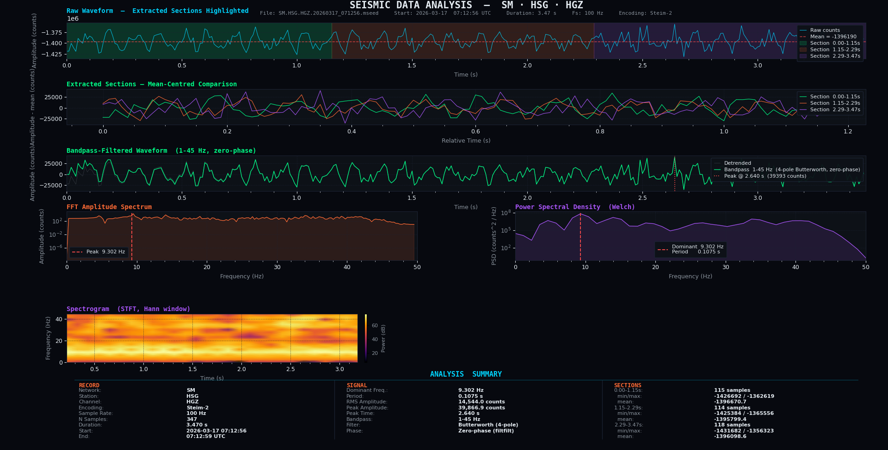

<div align="center">

<!-- Replace the URL below with your actual uploaded logo path after adding it to the repo -->
 alt="DOIT Company Logo" width="200"/>

# 지진 데이터 통합 과제
### Earthquake Data Integration Project

**Developed by Mohammad Tanvir**  
**주식회사 두잇 (DOIT Co., Ltd.)** · [www.k-doit.com](https://www.k-doit.com)

---


</div>

---

## 📌 Overview

This project integrates seismic data acquisition, parsing, and real-time visualization using the **Earthworm** seismological processing system. It reads raw **MiniSEED** files from a seismic station (`SM.HSG`), decodes **Steim-2** compressed waveforms, and generates detailed analysis plots including time-domain waveforms, spectrograms, FFT frequency analysis, and **Peak Ground Acceleration (PGA)** dashboards.

---

## 🗂️ Project Structure

```
earthquake-data-integration/
│
├── analysis.py                  # Core MiniSEED parser & multi-channel analysis
├── continuous_mseed.py          # Continuous MiniSEED data recorder
├── pga_live_dashboard.py        # Real-time PGA live monitoring dashboard
│
├── mseed_data/                  # Recorded MiniSEED waveform files (auto-generated)
│   └── SM.HSG.HG[ENZ].*.mseed  # 3-component seismic data (E, N, Z axes)
│
├── Earthworm_project_report.pdf # Full technical project report
├── Figure_1.png                 # Sample waveform analysis output
└── PGA_+_Live_Waveform_*.png    # PGA live dashboard screenshot
```

---

## ⚙️ Features

- **MiniSEED Parser** — Custom binary parser for SEED Fixed Section Data Headers (FSDH) and Blockette 1000
- **Steim-2 Decoder** — Full implementation of Steim-2 decompression per the SEED Reference Manual
- **Multi-Channel Analysis** — Simultaneous processing of HGE, HGN, HGZ (East, North, Vertical) components
- **Waveform Visualization** — Time-domain plots with instrument response and filtering
- **FFT Spectrum Analysis** — Frequency domain analysis of seismic signals
- **Spectrogram** — Time-frequency representation of waveform data
- **PGA Live Dashboard** — Real-time Peak Ground Acceleration monitoring via Earthworm connection
- **Continuous Recording** — Automated MiniSEED file recording from live seismic streams

---

## 🚀 Getting Started

### Prerequisites

```bash
pip install numpy matplotlib scipy
```

### Run Waveform Analysis

```bash
# Auto-detect and analyse latest MiniSEED file
python analysis.py

# Analyse a specific file
python analysis.py mseed_data/SM.HSG.HGZ.20260317_071250.mseed
```

### Start Continuous Recording

```bash
python continuous_mseed.py
```

### Launch PGA Live Dashboard

```bash
python pga_live_dashboard.py
```

---

## 📊 Sample Output

<div align="center">

<br/><em>Multi-channel seismic waveform analysis — Station SM.HSG</em>
</div>

---

## 📡 Station Information

| Parameter | Value |
|-----------|-------|
| Network | SM |
| Station | HSG |
| Channels | HGE, HGN, HGZ |
| Encoding | Steim-2 |
| System | Earthworm |

---

## 📄 Report

For full technical documentation, see [`Earthworm_project_report.pdf`](./Earthworm_project_report.pdf).

---

## 👤 Author

**Mohammad Tanvir**  
주식회사 두잇 (DOIT Co., Ltd.)  
🌐 [www.k-doit.com](https://www.k-doit.com)

---

<div align="center">
<sub>© 2026 주식회사 두잇 (DOIT Co., Ltd.) · All rights reserved.</sub>
</div>
